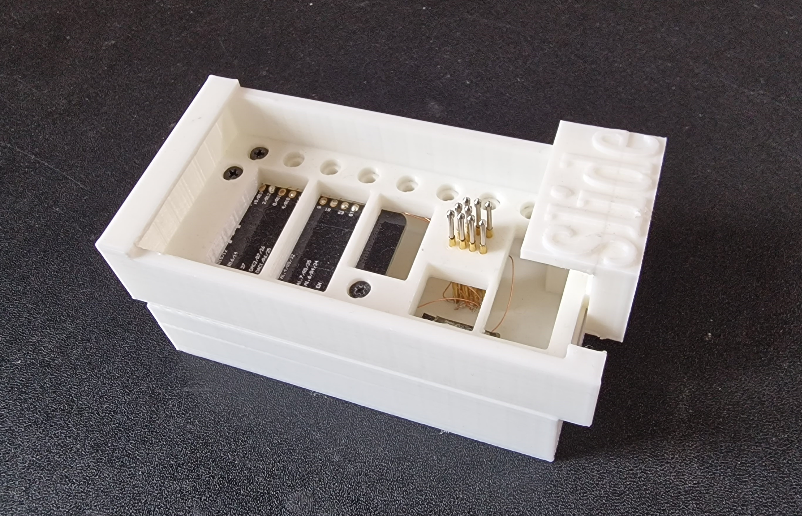
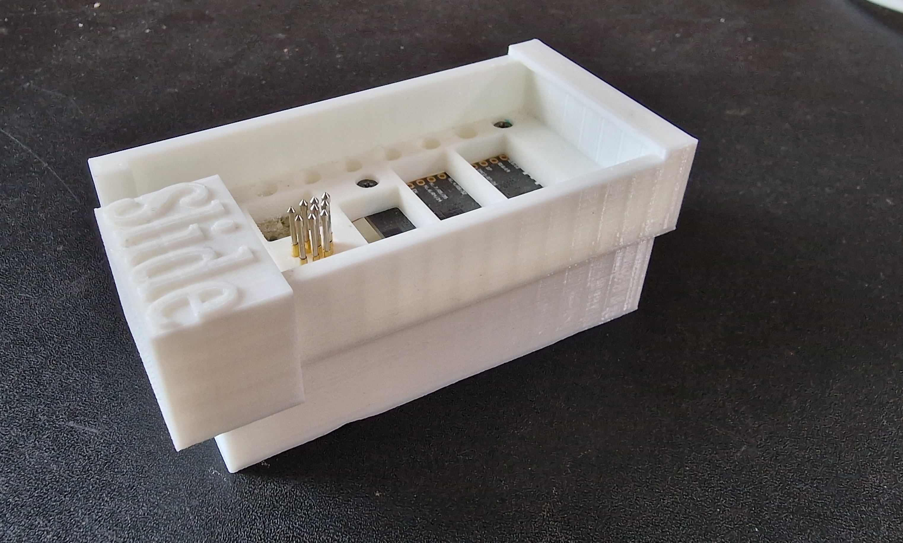

# 3D-printed programming jig

## Jig from [ATC1441](https://github.com/atc1441)

### Version: ZBS243_Pogo_Flasher

- The Jig is printed in 3 parts, and uses the 1.3mm Pogo Pins
- The Screws to connect the main and bottom body together need to be screwed in quite hard  anything from 1-3mm should work
- The body and screws are designed for the ESP32 Lolin32 Lite board

#### Also available [on Tinkercad](https://www.tinkercad.com/things/37yG0A1sEFw?sharecode=woPw-7fiiAaOwkRt-xzJYHstxwA_3Xcl5dmdgnPgwAw)
