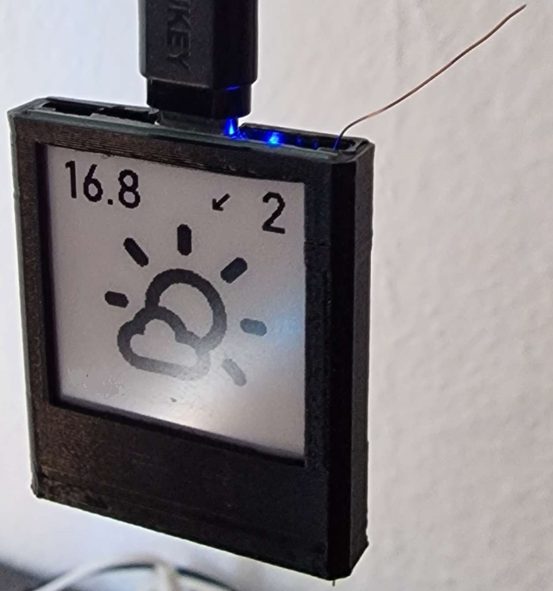
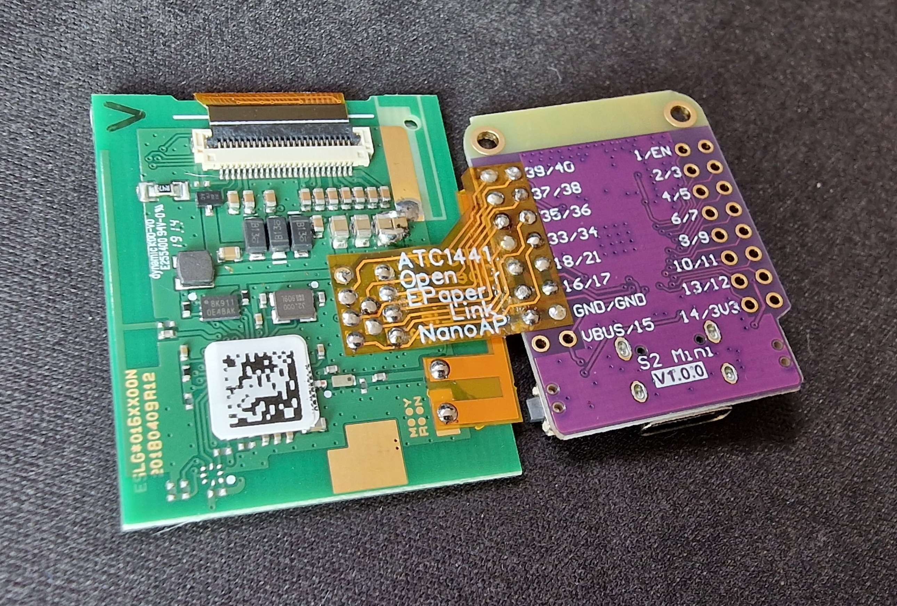
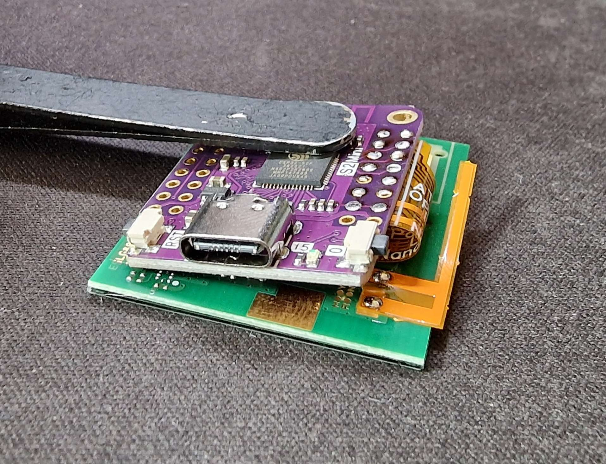

# 3D-printed ESP32-S2 Mini NanoAP with Flex PCB 

## NanoAP by [ATC1441](https://github.com/atc1441)

The NanoAP is build by using an 1.54" Display with an ZBS243 SoC and an ESP32 S2-Mini Dev-board(2MB SRAM Version)
The Flex PCB does also fit on the 2.9" Display, the case will not fit then :D

- The "NanoAP_Case_V3.stl" Case is printed in one go standing up, 0.2mm Layer height no support, infill 20%
- The Flex PCB can be ordered via the Gerber File "NanoAP_Gerber.rar"
- The Antenna from the Original case needs to be replaced by either a ~3cm wire or the "Antenna_FlexPCB_Gerber.rar"