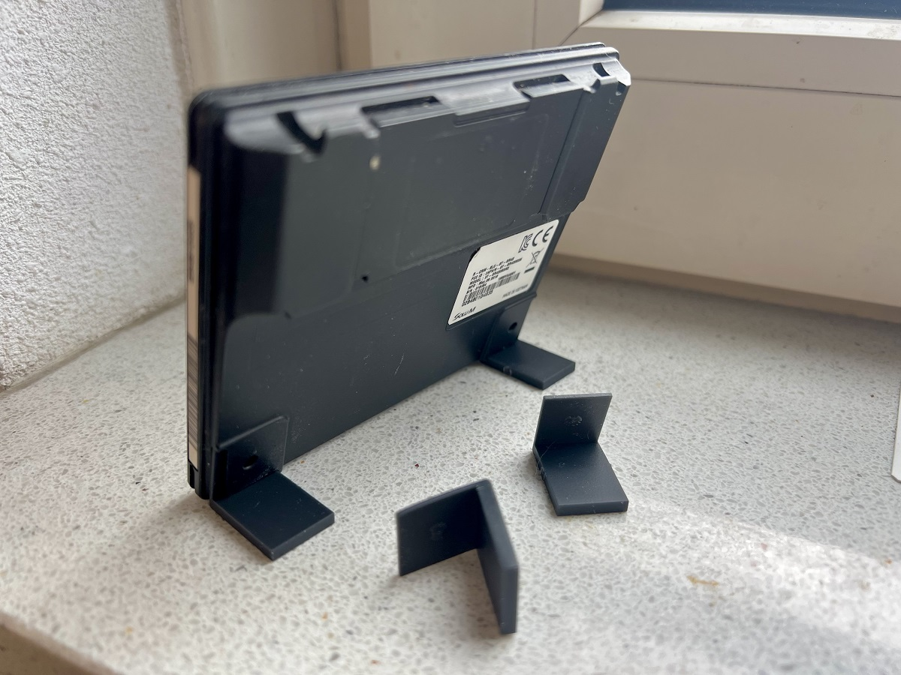
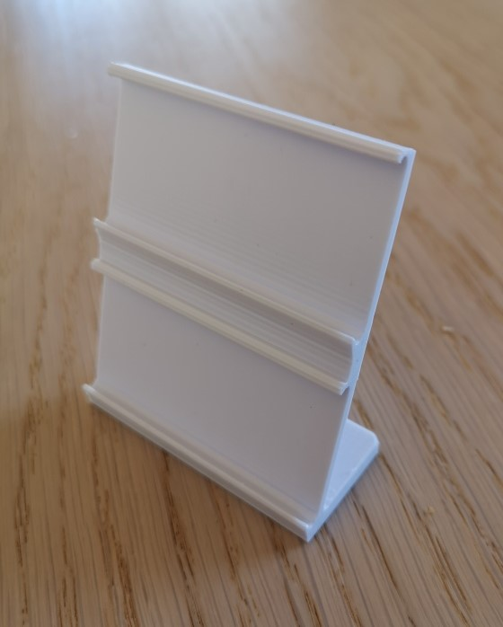
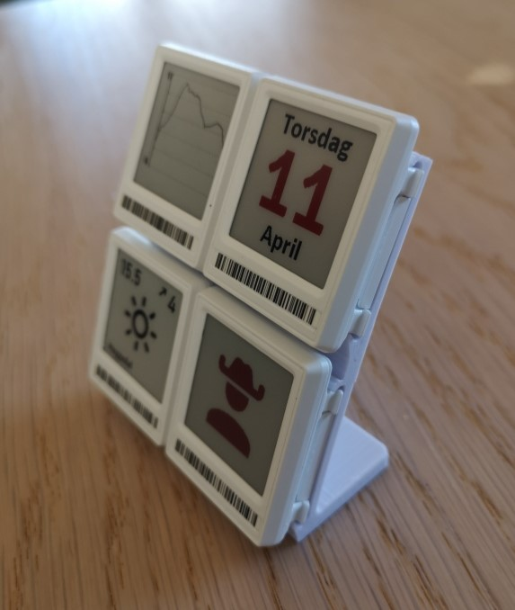

**A few accessories from the 3D printer**

**HOLDER & STANDS**

There are holder and stands for every tag. 1.54", 2.9" and 4.2". 

** 4.2 mini stand v2 by Nic.stl

4.2" mini stand by Nic. Note that these are designed with tight tolerances, to be printed on a resin printer. If you print it using your desktop 3D-printer, it might not fit.

** 4x 1.54" By Pål Hamre
File: 4x154_holder_by_Pal_Hamre.stl

** Chroma74 Debug JIG **

File: chroma74_debug_jig.STL

