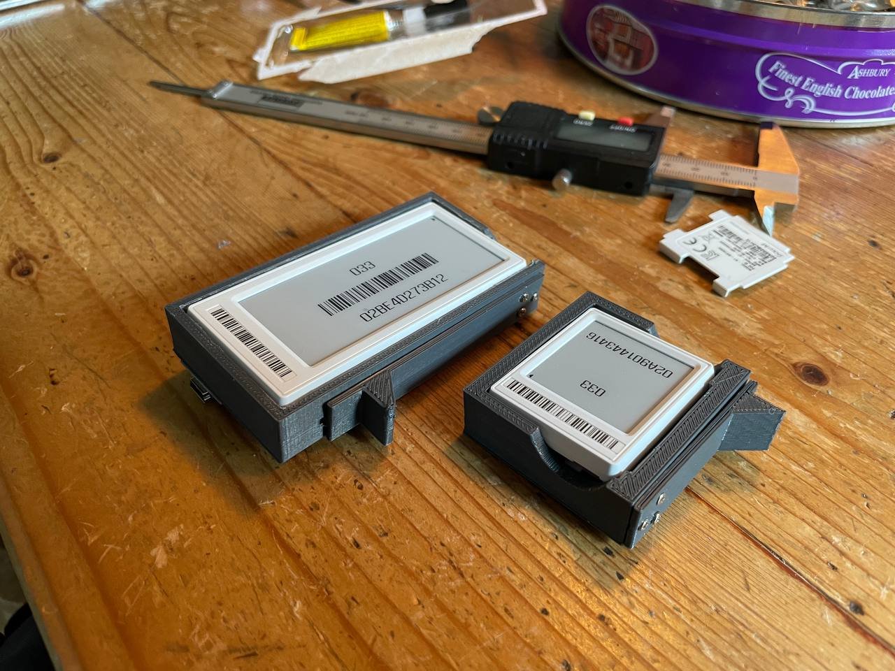

# 3D-printed programming jig (old style, no PCB required)

### Version: jig-16, jig-29 and jig-42

- This design uses 1mm pogo pins to connect to the pins on the 4.2"/2.9"/1.6" Solum ESL's. My printer doesn't have the resolution to properly do the 1mm holes in the smaller rectangle, so I use a soldering iron to coax the pins through the plastic. A 1mm drill works nicely too. Whatever works for you.
- Use small screws or some compatible glue to attach the latch to the side of the cradle
- I used hot glue to attach an arduino nano to the underside next to the exposed pogo pins. An ESP32 can also be used and has more memory to provide more features in the future, but I didn't want to waste one on this
