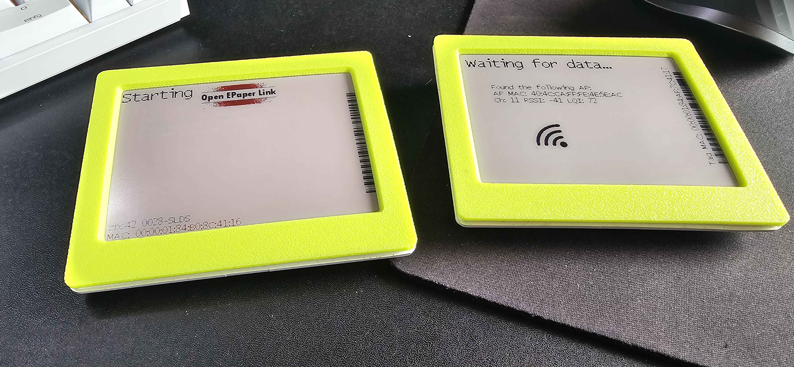

# New 3D Printable Front for the M2 4.2" Displays with Clear but scratched front

## by Corwin

Layer height between 0.1 and 0.2mm will work. 

The Front is a press fit and will most likely be one time use as the holding pins might break on removing from the case.

