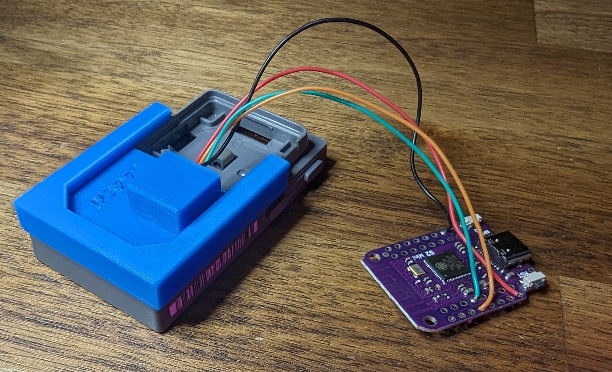
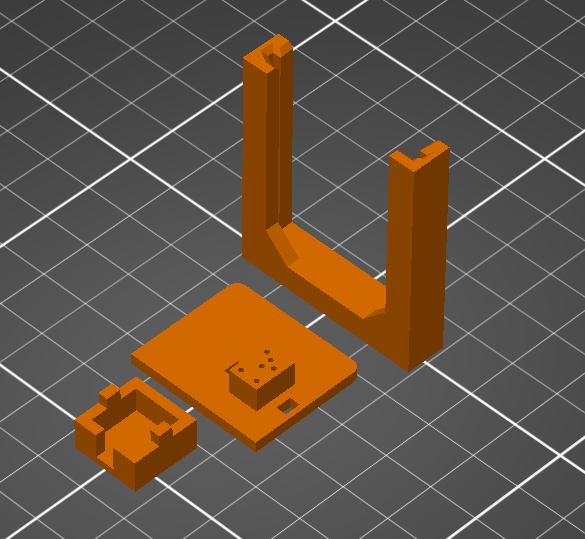
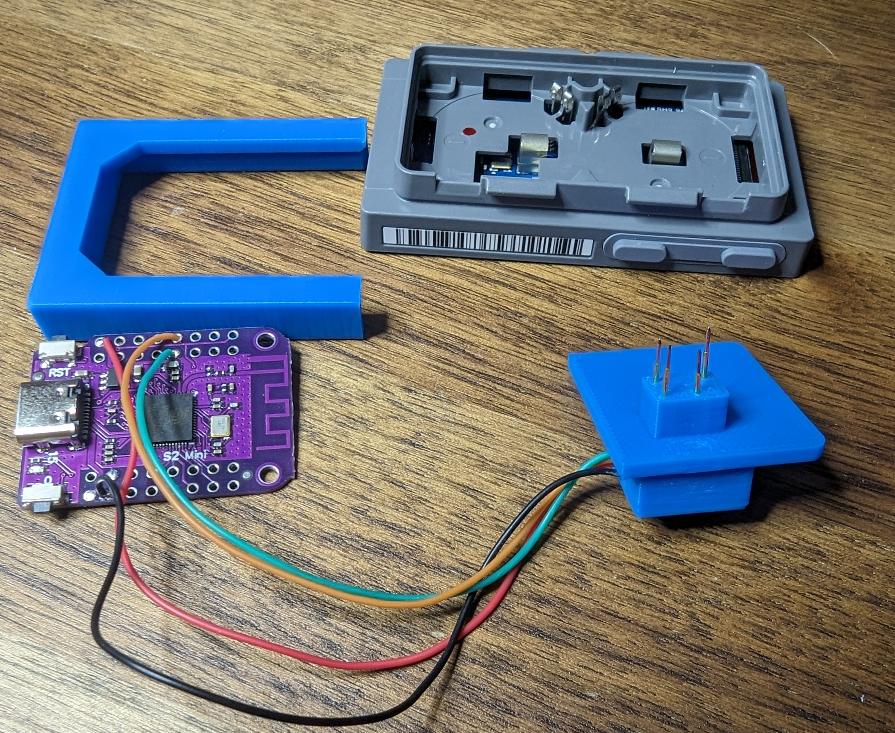
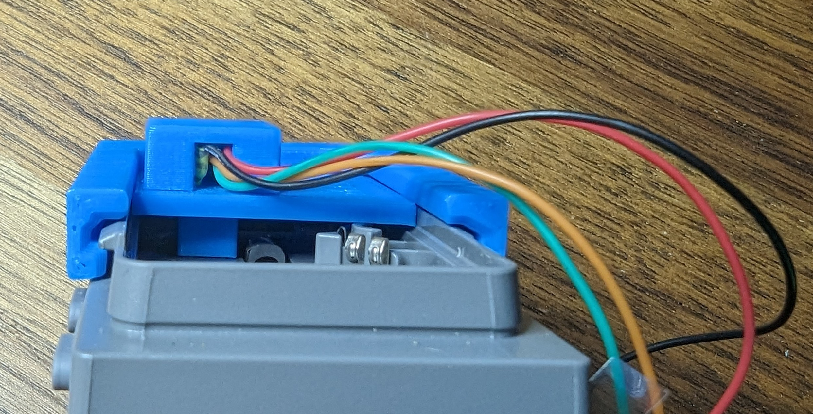

<!-- markdownlint-disable-file MD045 -->
# Programming jig for the M3 2.2 Newton board

There are three main components to the jig:

- [`pogo-base.step`](./pogo-base.step).
- [`pogo-cap.step`](./pogo-cap.step).
- [`retaining-sled.step`](./retaining-sled.step).

`STEP` files are provided for easy adjustment in your CAD package of choice or - if your slicer [supports it](https://blog.prusa3d.com/prusaslicer-2-5-is-here-new-perimeter-generator-step-file-support-lightning-infill-and-more_70562/) - direct printing.

I have also included the f360 archives used to create the parts:

- [`M3_2.2-inch_esl-module_pogo-programmer.f3z`](./M3_2.2-inch_esl-module_pogo-programmer.f3z): the main assembly
- [`M3_2.2-inch_esl-module.f3d`](./M3_2.2-inch_esl-module.f3d): CAD model of the ESL module used to design the jig.

All files are licensed under the [CC BY-SA 4.0](https://creativecommons.org/licenses/by-sa/4.0/) license.

## Printing

The suggested print orientation is shown below:

From bottom left to top right:

- `pogo-cap.step`: small end cap to prevent the pogo pins from falling out.
- `pogo-base.step`: the base of the jig. Holds the pogo pins in place. Has holes for `VCC`, `GND`, `SWDCLK`, `SWDIO`, `P0.25`, and `P0.26`.
- `retaining-sled.step`: slides over the edge of the ESL to hold the jig in place.

The [pogo pins](https://www.amazon.com/gp/product/B07RKMN3TG/) are about `.7` mm in diameter and are about `2.0` mm center-to-center.
All the parts designed with ~ `.15` mm tolerances so you'll want to print with a high quality profile and a small nozzle.

You will almost certainly not have good results with a `0.6` mm nozzle. I had usable results with a `0.4` mm nozzle but the `.25` mm nozzle was the best.

All the parts are small so even with a `.2` mm nozzle, you won't be waiting long for them to print.

Any plastic will do but I used PLA because it's what I had on hand.

## Assembly

Not much to it but you are working with very small parts and high AWG wire so things are fiddly and fragile.

I used `30 AWG` wire-wrap wire.
Other sizes should work but be mindful of the limited space between pogo pins.

Solder wires to the very end of the pogo pins.
Use a small bit of heat shrink tube to insulate the solder joint

Use high AWG wire to connect the pogo pins to the appropriate pins on your programmer.

Insert the pogo pins into the appropriate holes.
Use the [annotated picture](https://user-images.githubusercontent.com/2544995/254039393-4134bce5-34e0-4806-a917-8f59a1be0648.JPG) of the [2.9" ESL for reference](https://github.com/jjwbruijn/OpenEPaperLink/wiki/2.9%E2%80%B3-EL029H3WRA) to identify which holes you need to populate.

Figure out which direction you want the wires to exit from and install the cap.
Superglue is suggested to keep the cap in place but hot-glue can work too.

If you plan to use hot-glue, consider printing in PETG or ABS instead of PLA as PLA can deform under the heat of the glue.

