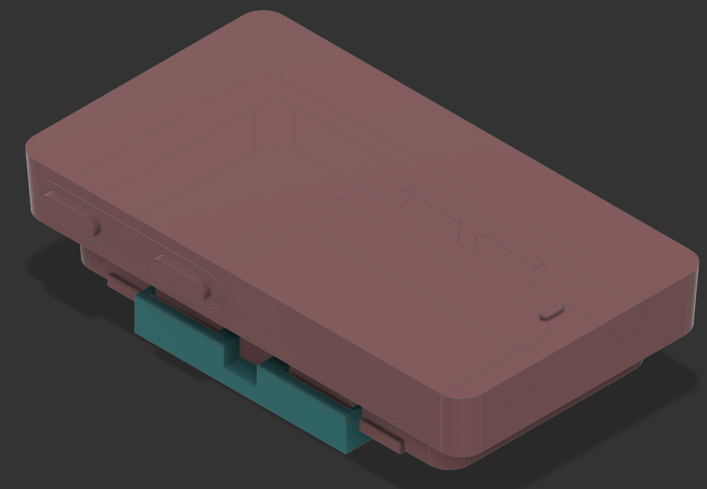
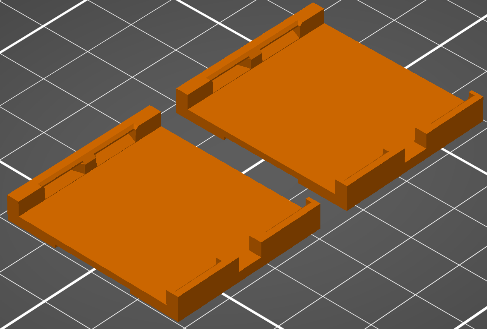
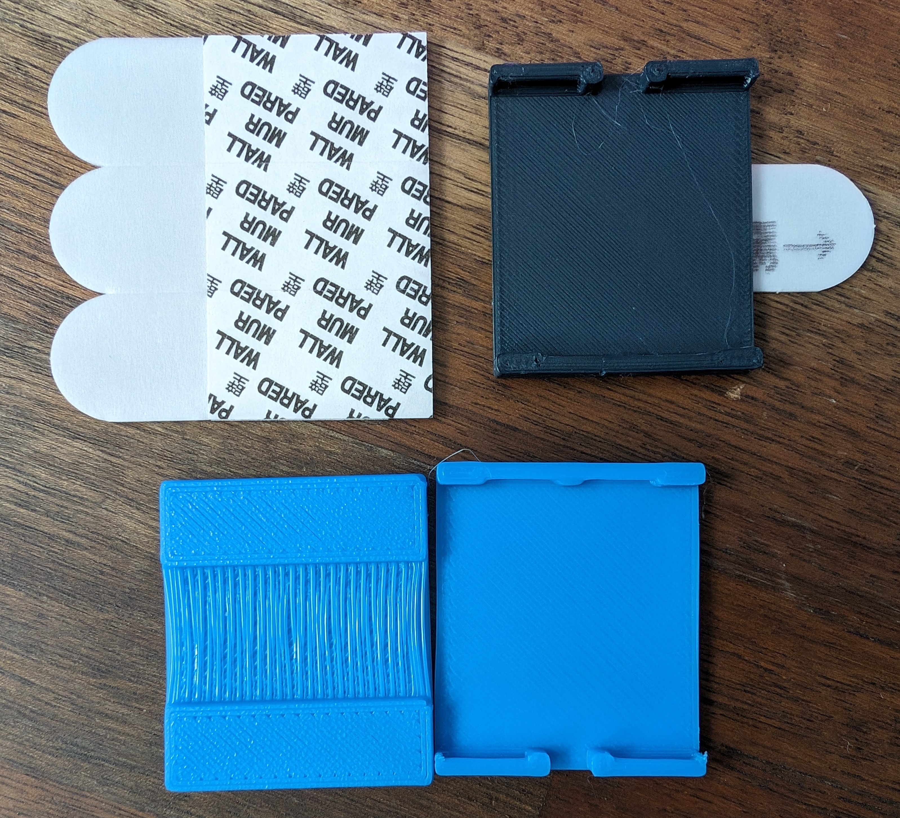
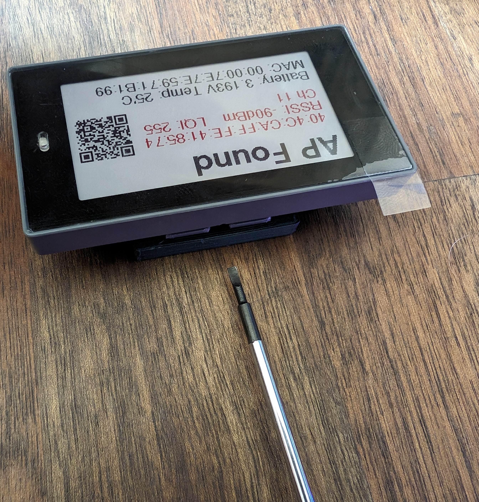

<!-- markdownlint-disable-file MD045 -->
# Mounting plate for the M3 2.2 Newton board

This is a super basic / minimal mounting plate for the M3 2.2 Newton ESLs.

The geometry is similar on the rest of the M3 family so using this with the other sizes should be as simple as scaling in your slicer but I don't have any of the other sizes to verify this.

The[`flat-surface-mount.step`](./flat-surface-mount.step) file is provided for easy adjustment in your CAD package of choice or - if your slicer [supports it](https://blog.prusa3d.com/prusaslicer-2-5-is-here-new-perimeter-generator-step-file-support-lightning-infill-and-more_70562/) - direct printing.

I have also included the [f360 archive](./flat-surface-mount.f3z) so you can modify as needed.
It references / uses the [`M3_2.2-inch_esl-module.f3d`](OpenEPaperLink/Hardware/M3 2.2 Newton Jig by kquinsland/M3_2.2-inch_esl-module.f3d) file as well.

All files are licensed under the [CC BY-SA 4.0](https://creativecommons.org/licenses/by-sa/4.0/) license.

## Printing

The suggested print orientation is shown below:

No support material is needed.
Print in any material you like but I used PLA because it's what I had on hand.
There are a few small features so relatively thin layer height and a small nozzle are recommended.
I have gotten acceptable results with a `0.4` mm and `0.6` mm nozzle and `0.2`mm layer height but your mileage may vary.

## Assembly

The mount features a shallow recess on the back that is just wide enough for a small 3M Command Strip to fit.
You can also use double-sided tape or glue if you prefer.

There's only one way that the tag fits into the mount:

The mount was designed to be a tight snap fit so the tag could safely be mounted to appliances that vibrate or moved around a lot.
If you need to remove the tag for any reason, you should use a small flat head screwdriver or similar to gently pry the tag out of the mount.

Counter intuitively, the best place to pry from is **not** the place that looks like it'll be the best place to pry from.
You'll have an easier time prying from the side pictured above.
