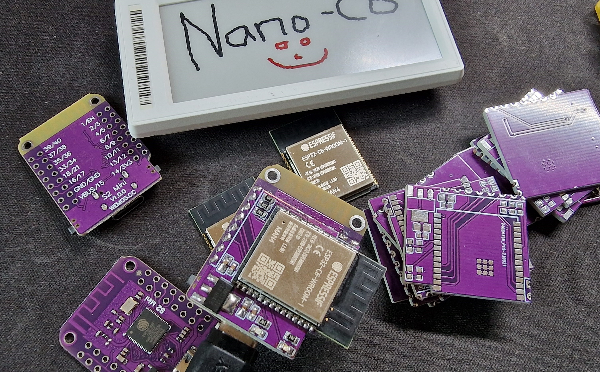
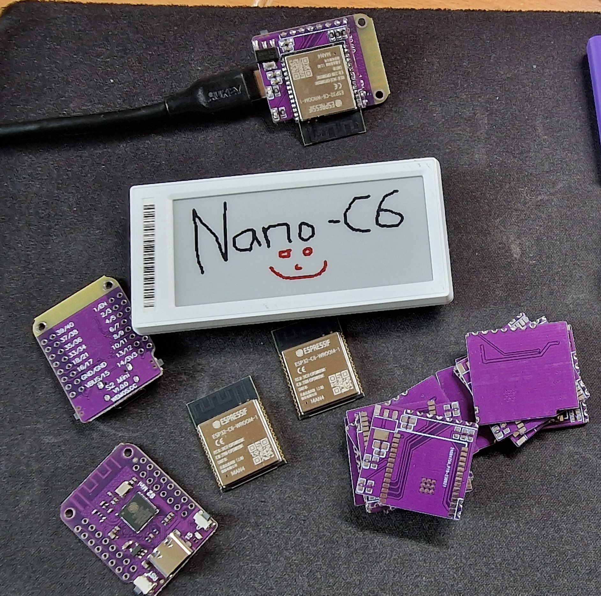
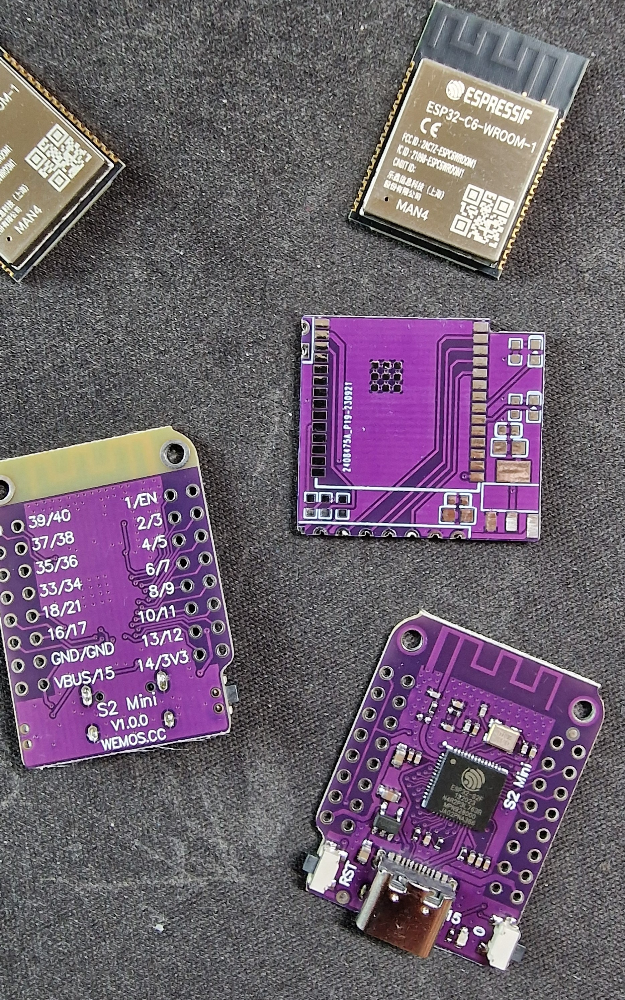

# PCB for the NanoC6 AP running an ESP32-C6 and the WEMOS S2-Mini

## NanoC6_AP by [ATC1441](https://github.com/atc1441)

# ATTENTION: This NanoC6 AP is not longer supported and legacy, please use the new S3_C6_NanoAP as a replacement 
https://github.com/jjwbruijn/OpenEPaperLink/tree/master/Hardware/S3_C6_NanoAP%20by%20ATC1441

The NanoC6_AP is made with the WEMOS S2-Min With an ESP32-S2 ( https://de.aliexpress.com/item/1005004981201254.html )
together with this PCB and an ESP32-C6 it makes a potent but small Access Point for the OpenEPaperLink with an impressive range.

Gerber of the PCB can be found in this folder

Parts for the PCB:
- 1x ESP32-C6
- 2x 0603 LEDs in the color of your choice
- 2x 0603 Resistor 1K for the LEDs (0805 fits as well)
- 3x 0603 Resistor 10K for Enable, flash pull-up and Boot line of ESP32-C6 (0805 fits as well)
- 2x 0603 Capacitor 100nf for 3.3V and 5V Rail
- 2x 0805 Capacitor 1uf for the 3.3V and 5V Rail
- 1x AMS1117 3.3V LDO Voltage regulator
