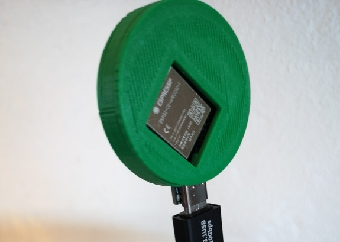
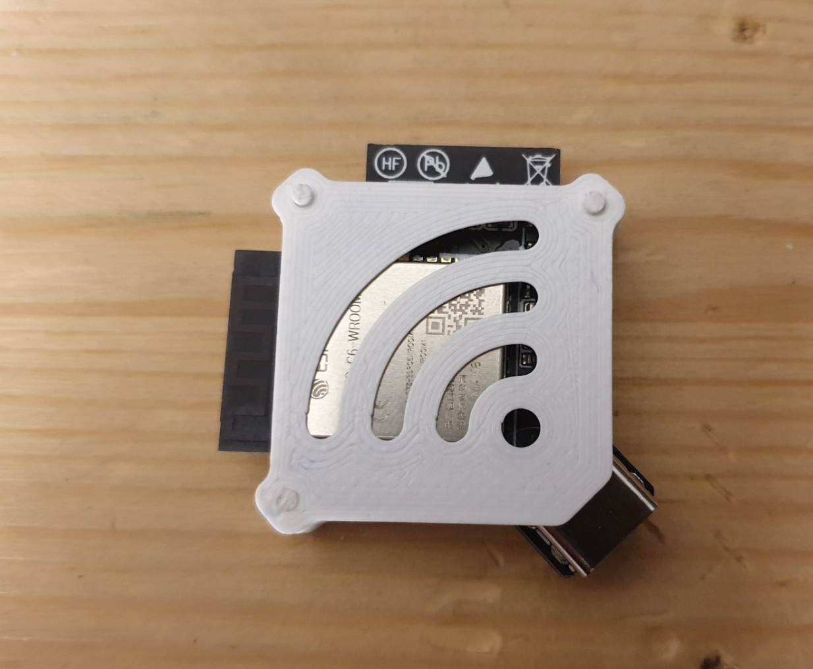
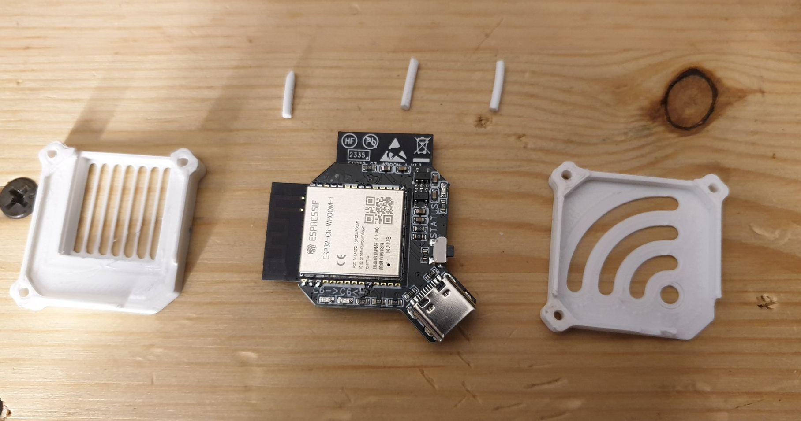

## V1 S3 C6 NanoAP Case ##

This is a tiny case for the Nano AP, meant for C6 modules with an IPEX connector instead of the PCB antenna. You'll need a small external PCB antenna, which goes into a slot on the side.

The S3 and C6 are cooled by 20x20mm heatsinks that are stuck on with double-sided heat-conducting tape.

## V2 NanoAP Case ##

#### Variant 1
This case is made by: Pål Hamre

File: V2 NanoAP Case Pal Hamre.stl

#### Variant 2
This case is made by: Viktor Knall

File: V2_2 NanoAP Case.3mf

