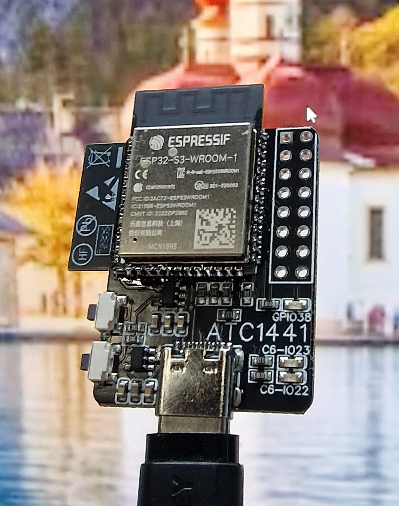
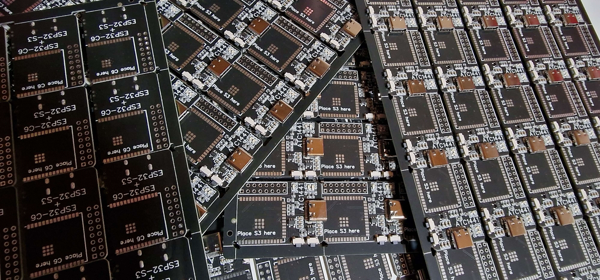
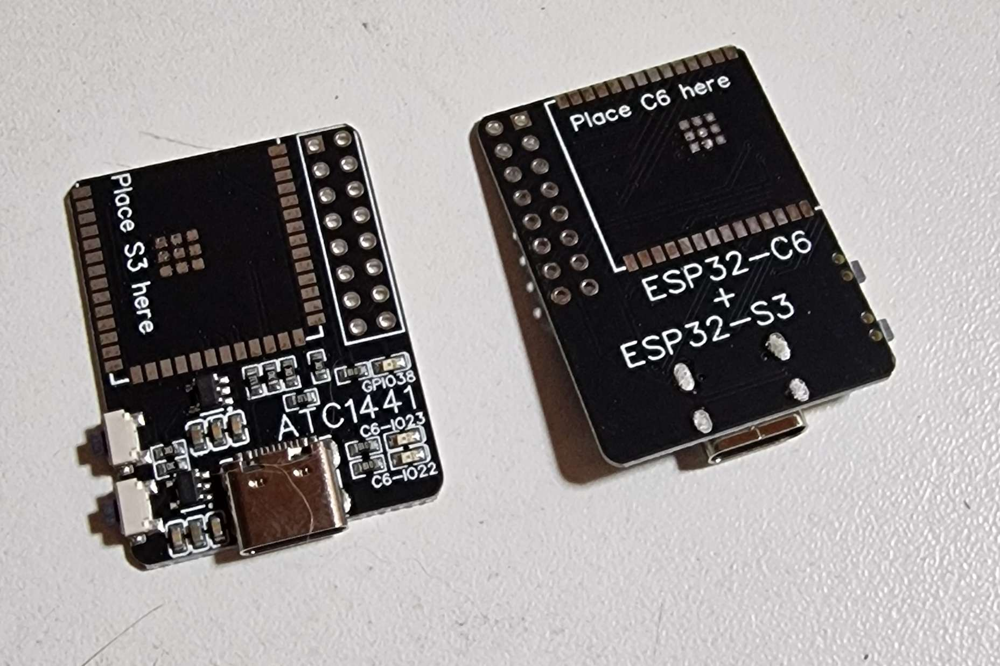
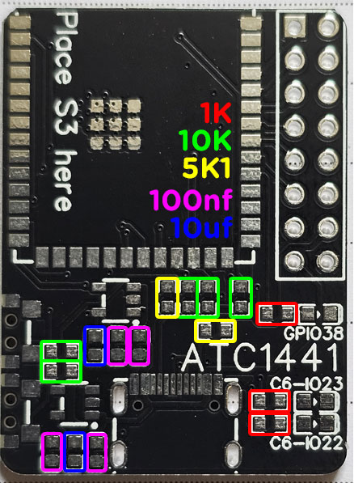

# PCB for the S3_C6_NanoAP running an ESP32-S3 and ESP32-C6

## S3_C6_NanoAP by [ATC1441](https://github.com/atc1441)

The S3_C6_NanoAP is made with an ESP32-S3
together with this PCB and an ESP32-C6 it makes a very potent Access Point for the OpenEPaperLink with an impressive range and small size.

Gerber of the PCB can be found in this folder

Parts for the PCB:
- 1x ESP32-S3-WROOM-1-N16R8
- 1x ESP32-C6-WROOM-1-N8 or ESP32-C6-WROOM-1U-N8
- 3x 0603 LEDs in the color of your choice : LTST-C190KRKT
- 2x 0603 Capacitor 10uf : CL10A106KP8NNNC
- 2x Button : TS24CA
- 2x 0603 Resistor 1K for the LEDs : 0603WAF1001T5E
- 5x 0603 Resistor 10K for Buttons, Enable, flash pull-up and Boot line of ESP32-S3 and C6 : 0603WAF1002T5E
- 2x 0603 Resistor 5,1K for USB-C : 0603WAF5101T5E
- 2x SOT23-5 LDO 6V to 3.3V : ME6211C33M5G
- 1x 16pin USB-C Connector : TYPE-C 16PIN 5A 143
- 4x 0603 Capacitor 100nf : CC0603KRX7R9BB104

## BOM Passives Placement Guide

