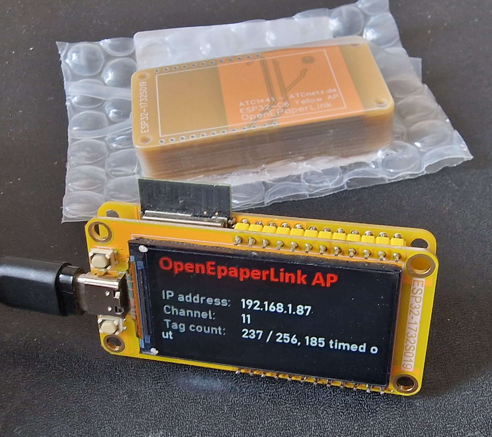
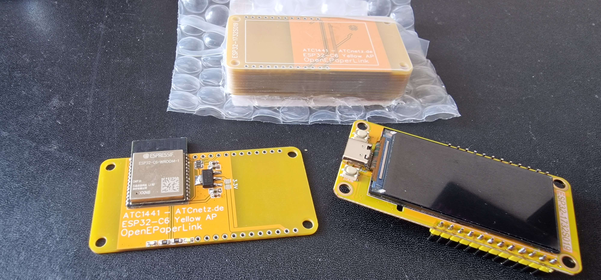
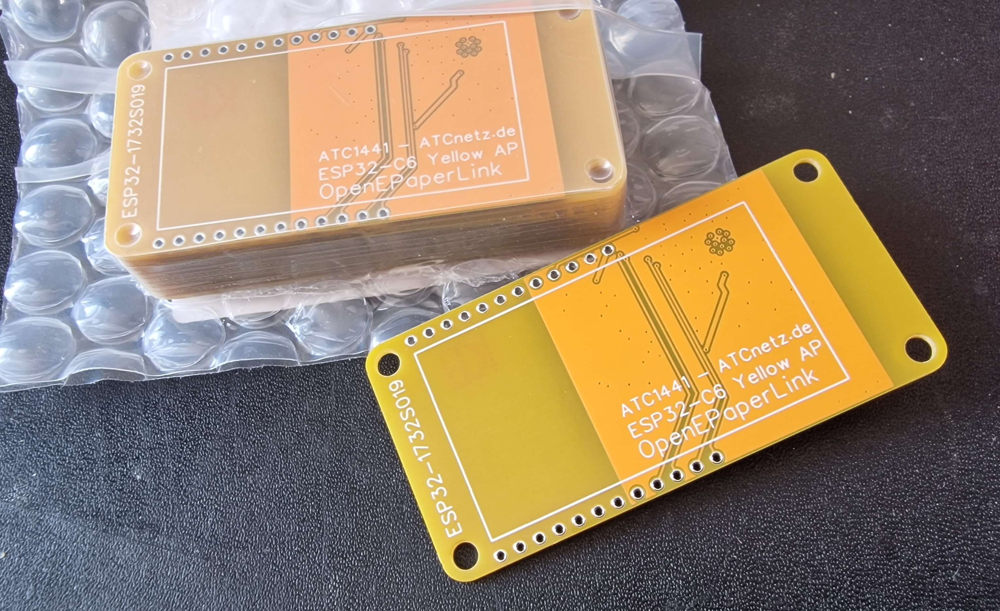
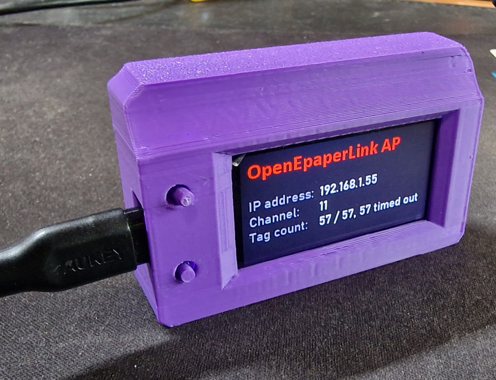
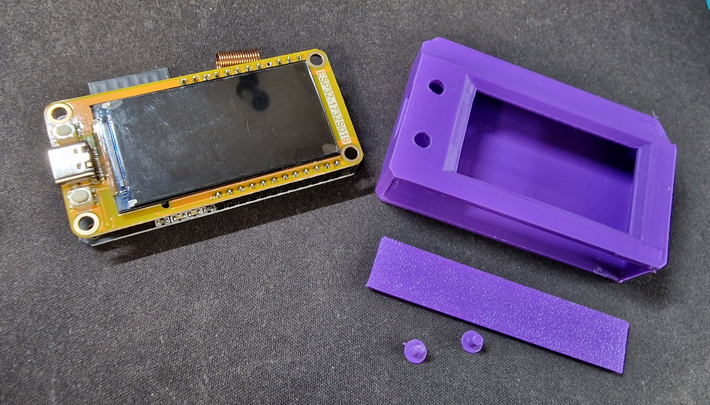

# PCB for the Yellow AP running an ESP32-C6 and the "Yellow IPS LCD"

## Yellow_AP by [ATC1441](https://github.com/atc1441)

The Yellow_AP is made by the Yellow IPS Display with integrated ESP32-S3 ( https://de.aliexpress.com/item/1005005059421229.html )
together with this PCB and an ESP32-C6 it makes a very potent Access Point for the OpenEPaperLink with an impressive range.

Gerber of the PCB can be found in this folder

Parts for the PCB:
- 1x ESP32-C6
- 2x 0603 LEDs in the color of your choice
- 2x 0603 Resistor 1K for the LEDs (0805 fits as well)
- 3x 0603 Resistor 10K for Enable, flash pull-up and Boot line of ESP32-C6 (0805 fits as well)
- 1x 0603 Capacitor 100nf for 3.3V Rail
- 1x 0805 Capacitor 1uf for the 3.3V Rail

OPTIONAL from here on, either install the regulator for better power consumption and continue with these parts or bridge the 3.3V Solder pads
- 1x AMS1117 3.3V LDO Voltage regulator
- 1x 0603 Capacitor 100nf for 5V Rail
- 1x 0805 Capacitor 1uf for the 5V Rail
- 1x CC1101 868MHz "Green" Module, Important to use the 868MHz version

## 3D Printable case

A 3D Printed case can be found in the "3D_Case" Folder
Print the 3 parts without support 0.2mm layer height and 20% infill.

1 x main <- Main body, make sure you got a good first layer adhesion 

1 x bottom <- this one is a press fit and may need some cutting 

2 x button <- best is to print one by one, depends on your printer, but can also be left out
