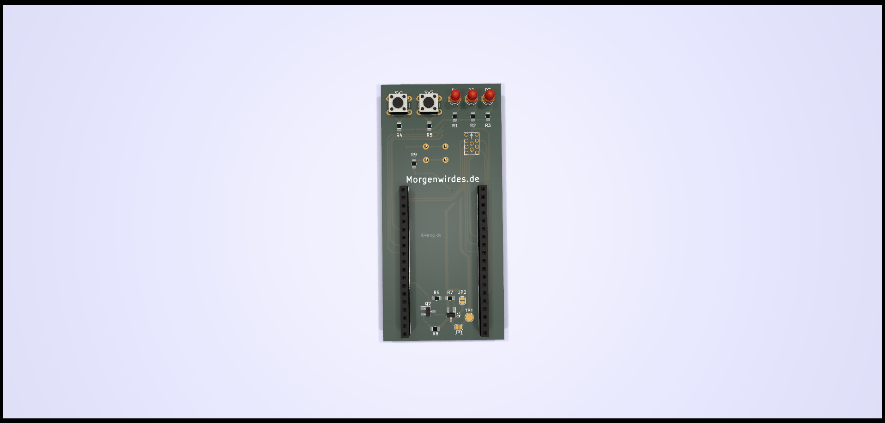
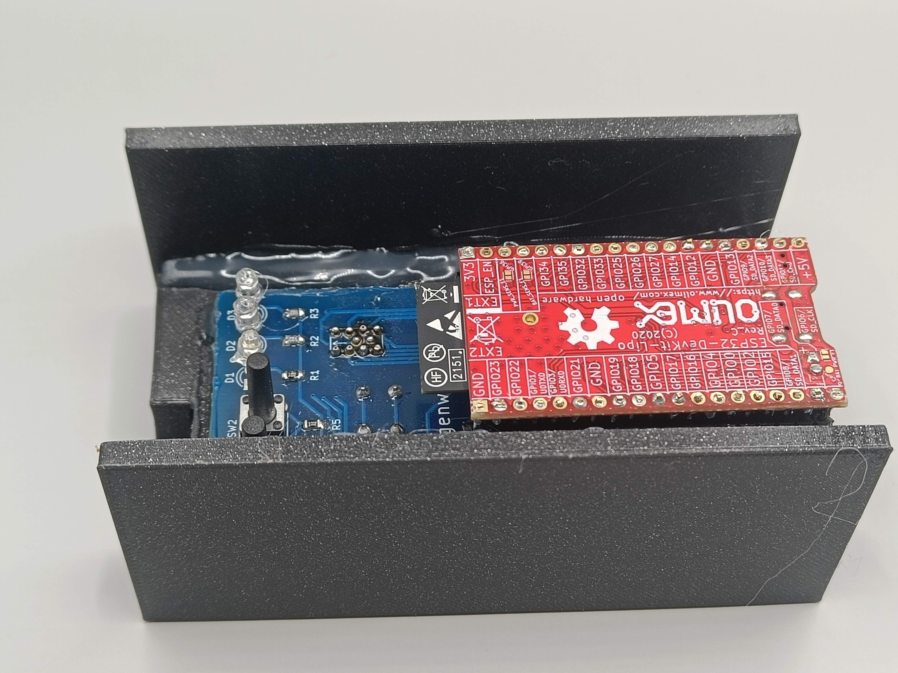

# alternative PCB for 2.9" flashing#

This is an alternative PCB for flashing 2.9" ESLs

### Parts (per board) ###
* 10x 1mm pogo pin 
* 3x Switches
* 3x 3mm LEDs
* 3x 0805 SMD resistor (47 ohm or so, depending on LED color, personal taste, whatever)
* ESP32-DevKit-Lipo form Olimex
* please check the PCB for the rest

### Errata ###
The ESP32 board needs to be solder upside down

## Getting PCB's ##
You can order the boards from your favorite boardhouse, using the zip file in this repository. 

## Disclaimer ##
There is no guarantee or warranty whatsoever, nor is there any promise or insinuation that this board fill fullfill any particular purpose. This board may very well not work for you, set your hair and/or, but not limited to, pants on fire, incite violance or persuade other countries to invade your country. You're on your own, chief!
